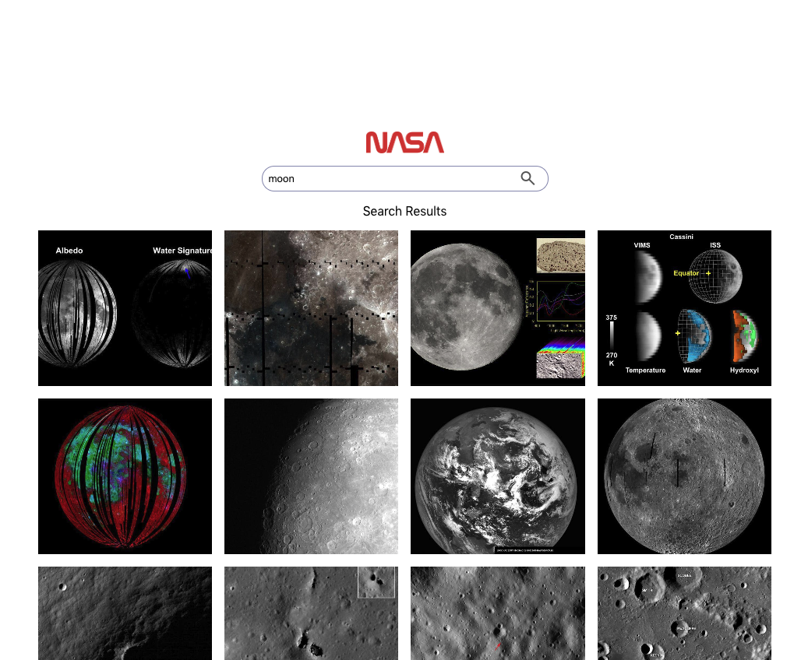
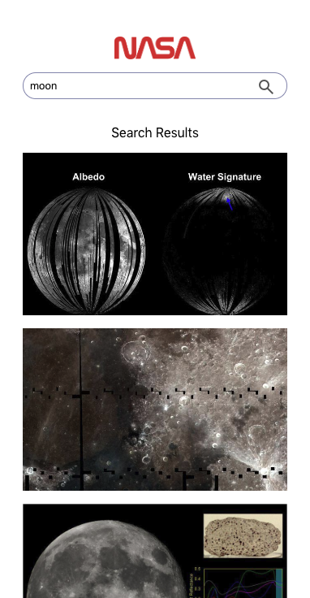

# Nasa Search Engine - Mock Techinical Test

## Description

As part of MCR's frontend module i was asked to take on a mocK technical test.
You are expected to build a React web application that allows users to search for images based on a query relating to space. You are provided the NASA API endpoint for image search.
We want you to consider and add anything to your repository that should be included was this to be a live website.

The following functionalities need to be implemented:
● A Search page which allows users to search for images by keyword
● Images must be returned upon a successful search

## Screenshots

## What this app was built with

React

## Testing Utilites used

- Jest
- React Testing Library

## Packages Used

- Axios

## Run Instructions

`npm start`

## Things i would add if i had more time

1. Unique alt text for image results
2. Ability to expand images
3. Surfaced more result meta data
4. Aria labeling for accesibility
5. A save/download button
6. Filtering by metadata such as date or time
7. Sorting search results by relevance

## Authors name

Okori

## Available Scripts

In the project directory, you can run:

### `npm start`

Runs the app in the development mode.\
Open [http://localhost:3000](http://localhost:3000) to view it in your browser.

The page will reload when you make changes.\
You may also see any lint errors in the console.

### `npm test`

Launches the test runner in the interactive watch mode.
